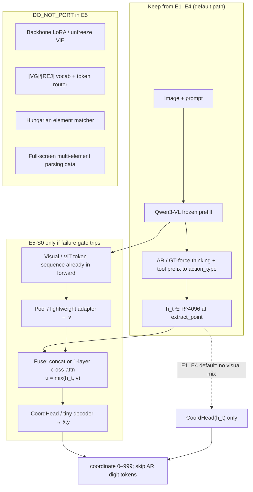

# Plan: E1–E4 Thinking-Aware Regression Head Campaign (+ E5 post-gate contingency)

> Status: **PLAN REVIEWED** (2026-07-24, T0). Ready for T1. No application code / SLURM in this turn.
> Project: `/dkucc/home/rw335/GUIAccel` — Coordinate Regression Head on Qwen3-VL-8B-Instruct.
> Goal: close Reg vs AR accuracy gap caused by **thinking mismatch**, while keeping **time complexity / latency ratio / token I/O** first-class and non-inflated.
> **Default E1 variant for T1: E1-A** (template thinking). E1-B / E3 are escalation / upper-bound only.
> **E5 (SparkUI-style latent mix):** contingency **after** E1–E4 failure gate only — see §E5.

---

## 0. Algorithm metrics (mandatory for every step)

For each experiment / gate, report all three (plus accuracy):

| Metric | Definition (this campaign) | Prefer |
|--------|----------------------------|--------|
| **Time complexity** | Prefill: \(O(L_{\text{in}}^2)\) attention (FA2 practical \(O(L_{\text{in}})\)); Decode: \(O(T_{\text{out}})\) serial steps; Head: \(O(d\cdot h)=O(1)\) vs backbone | Keep extract = **1 forward**; decode path must not add extra full generates beyond necessity |
| **Latency ratio** | \(\rho = t_{\text{new}} / t_{\text{AR}}\) on same hardware, same episodes | Fair Reg must include **thinking decode** (see §2.2); do not claim current GT-force-only Reg latency as deployable |
| **Token I/O** | Input tokens (prompt+image) + output tokens generated | Reg should cut **coord tokens only** (~6–9); thinking tokens remain unless a later campaign compresses them |

**Forbidden (unless unavoidable and flagged):** methods that inflate \(\rho\), add second full AR passes at deploy time, or inflate output tokens “for accuracy.”

---

## 1. Current baseline (facts from repo)

### 1.1 Code / docs paths

| Role | Path |
|------|------|
| Hidden-state extract (GT-Forcing Prefill) | `guiaccel/model/hidden_state_extractor.py` — `extract_hidden_state`, `GT_PREFIX_TEMPLATES`, `load_model_for_extraction` |
| Coord head | `guiaccel/model/coord_head.py` — `CoordRegressionHead` (LayerNorm + MLP 4096→256→2) |
| Decode eval helpers | `guiaccel/model/coord_decode_eval.py` — `autoregressive_decode_coords`, `regression_predict_coords` |
| Experiment entry | `experiments/regression_head.py` — `--mode extract\|train\|eval` |
| SLURM scripts | `run_scripts/regression_head/extract_4gpu.sh`, `train_1gpu.sh`, `eval_decode_4gpu.sh` |
| Technical status doc | `agents.md` (**stale** vs reality — see §1.4) |
| Research roadmap | `docs/plan.md` |
| This campaign plan | `docs/plan_e1_e4_thinking_aware.md` |

### 1.2 Artifacts

| Artifact | Path | Notes |
|----------|------|-------|
| Full train extract (job **31572**, COMPLETED, ~2h14m, 4×A40) | `outputs/regression_head/20260723_050425/extracted/train_hidden_states.pt` | **46,581** × 4096; ~729MB |
| Worker shards | `.../extracted/worker_{0..3}/train_hidden_states.pt` (+ checkpoints) | Workers store key `meta`; merge wrote empty `metadata` (bug; train still OK) |
| Smoke extract | `outputs/regression_head/extracted/train_hidden_states.pt` | Tiny; ignore for training |
| Latest trained head | `outputs/regression_head/train_20260723_121025/trained/coord_head_best.pth` | Best epoch 46; symlink extract → 20260723_050425 |
| Prior train runs | `train_20260723_115940`, `train_20260723_120735` | Same family; use **121025** as current |
| Smoke decode eval (58 samples) | `outputs/regression_head/decode_eval_20260723_124417/eval/summary.json` | Complete small-N summary |
| Full decode eval (job **31620**) | `outputs/regression_head/decode_eval_20260723_125016/` | **CANCELLED** after ~34m; partial `checkpoint_*.json` only |

**Model path:** `/dkucc/home/rw335/GUIAccel/models/Qwen3-VL-8B-Instruct`  
**Env:** `skillreuse-fa2` (`GUIACCEL_CONDA_PREFIX` in scripts)  
**`.env` keys used:** `GUIACCEL_BASE_MODEL_PATH`, `GUIACCEL_ANDROIDCONTROL_DATASET_MANIFEST` (→ `data/androidcontrol/manifest.json`)

### 1.3 Known metrics

**Train (121025)** on no-thinking GT-Forcing features:

| Metric | Value |
|--------|-------|
| Samples after in-bound filter | 46,570 (train 37,256 / val 9,314) |
| Params | 1,057,538 (includes LayerNorm) |
| Best val Smooth-L1 | 0.0382 @ epoch 46 |
| Best val MAE@999 | **42.61** |
| Final epoch val MAE@999 | 45.21 |

**Decode eval — smoke (58 test CLICK/LONG_PRESS):**

| Metric | Reg | AR |
|--------|-----|-----|
| MAE vs GT (mean) | 45.9 | 46.0 |
| MAE median | 23.0 | **5.5** |
| within-20 @999 | 0.47 | 0.62 |
| **bbox hit rate** | **0.53** | **0.90** |
| mean latency | 594 ms | 7088 ms |
| \(\rho\) (Reg/AR) | **0.088** | 1.0 |
| tokens_saved_estimate mean | ~114 (vs short Reg prefix ~18) | — |

**Decode eval — partial cancelled job 31620 (~800 unique samples from worker checkpoints):**

| Metric | Reg | AR |
|--------|-----|-----|
| MAE vs GT | ~43.0 | ~33.8 |
| bbox hit | **~0.55** | **~0.92** |
| within-20 | ~0.46 | ~0.74 |
| \(\rho\) | ~0.081 | 1.0 |
| AR gen tokens mean | — | ~134 |
| Reg prefix tokens mean | ~18 | — |
| AR outputs with `<thinking>` | 800/800 | — |

**Interpretation:** Reg is ~11× “faster” in current eval because it **skips thinking** via GT-Forcing; accuracy (esp. bbox hit / median MAE) remains far behind AR.

### 1.4 Job 31620 — cancelled / not needed

```
sacct -j 31620 → State=CANCELLED+, Elapsed=00:34:24
Partition=common-gpu, gres/gpu=4
```

- User cancelled; **do not resume**.
- Partial checkpoints are **diagnostic only**; not a final baseline.
- After E1 retrain, run a **new** fair decode-eval job (new timestamped `outputs/…` dir; never overwrite).

### 1.5 `agents.md` status

As of T0 verify (2026-07-24), `agents.md` checklist matches reality (31572 done, 121025 done, 31620 cancelled, campaign next=T1). Keep it that way:

- [x] Extract full train (31572)
- [x] Train CoordHead (121025)
- [x] Decode-eval plumbing + smoke
- [ ] Fair full-test decode eval (31620 cancelled)
- [ ] Thinking-aware extract / retrain (this campaign)

Update `agents.md` only when implementers land verified milestones (see §6) — no extra md spam.

---

## 2. Root-cause statement

### 2.1 What AR actually generates

Qwen3-VL AndroidControl / mobile_use format (from `qwen_backend` system prompt + smoke/partial eval `raw_output`):

```text
<thinking> … plan / target element … </thinking>
<tool_call>
{"name": "mobile_use", "arguments": {"action": "click", "coordinate": [x, y]}}
</tool_call>
```

Empirically, **100%** of AR samples in the cancelled-run sample include a thinking block; thinking body ~450 chars on average.

### 2.2 What current GT-Forcing extracts

`GT_PREFIX_TEMPLATES` forces only:

```text
<tool_call>
{"name": "mobile_use", "arguments": {"action": "click"
```

(~18 tokens). **No `<thinking>` tokens.** Last-position hidden \(h_t\) is therefore the representation **after action-type, conditioned on an empty CoT**.

### 2.3 Causal-attention argument

Let tokens be \(x_{0:L}\) (prompt+image) ‖ \(y_{1:T}\) (assistant). Causal mask ⇒

\[
h_t = f_\theta(x_{0:L}, y_{1:t})
\]

depends only on prefixes up to \(t\).

- **AR path at action_type:** \(y\) includes thinking tokens \(y^{(\text{think})}\) then tool_call up to `"click"`.  
  \[
  h_t^{\text{AR}} = f_\theta(x,\, y^{(\text{think})},\, y^{(\text{tool up to action})})
  \]
- **Current train/eval Reg extract:**  
  \[
  h_t^{\text{GT0}} = f_\theta(x,\, y^{(\text{tool up to action})})
  \]

By causal dependence, \(h_t^{\text{GT0}} \neq h_t^{\text{AR}}\) in distribution whenever thinking carries grounding (target widget, screen region). The MLP is trained on \(h_t^{\text{GT0}}\) but is **marketed** as a drop-in for the AR trigger point that sees \(h_t^{\text{AR}}\). That train/serve mismatch (plus information deficit) explains **Reg bbox hit ~0.53–0.55 vs AR ~0.90–0.92** despite similar *mean* MAE (heavy tails / median gap).

### 2.4 Latency fairness bug (must fix in reporting)

Current `regression_predict_coords` calls the same no-thinking GT-Forcing extract → \(\rho\approx0.08\). Deployable Reg **still pays for thinking decode** (or a cheaper substitute). Fair latency:

\[
\rho_{\text{fair}} = \frac{t(\text{decode until action\_type}) + t(\text{MLP})}{t(\text{full AR})}
\]

Expected: \(\rho_{\text{fair}} \approx 0.85\text{–}0.95\) if only ~6–9 coord tokens are skipped (thinking ≫ coords). Campaign success is **accuracy recovery under this fair \(\rho\)**, not chasing the unfair 0.08.

---

## 3. Experiment designs E1–E4

### E1 — Thinking-aware GT-Forcing (primary; expected biggest hit-rate gain)

**Goal / hypothesis**  
If we force a thinking-aware prefix so train-time \(h_t\) matches the AR trigger distribution, CoordHead bbox hit rises toward AR (target: **≥ 0.75** on smoke; **≥ 0.80** on full test vs AR ~0.90), without adding deploy-time FLOPs beyond existing thinking decode + MLP.

**Thinking text source — T1 locks E1-A; do not implement E1-B in T1:**

| Variant | Thinking content | Extract cost | Faithfulness |
|---------|------------------|--------------|--------------|
| **E1-A (DEFAULT for T1/T2)** | Deterministic template from `step_instruction` + action_type (dataset has `step_instructions`; **no GT CoT**) | Still **1 forward**; longer \(L\) | Format-aligned; content approximate |
| **E1-B** (escalation only) | Cached AR thinking from a prior generate (subset or full) | Extract cheap; **cache build = AR cost** | Upper-bound distribution |

**Why E1-A first:** AndroidControl has no GT CoT; E1-A is zero extra AR cost, still one prefill forward, and is enough to test the causal-mismatch hypothesis. E1-B / E3 answer “is the template the remaining gap?” only after E1-A lands.

**Exact code touch points**

- `guiaccel/model/hidden_state_extractor.py`
  - Extend `GT_PREFIX_TEMPLATES` / add `build_gt_prefix(step, mode=..., extract_point=...)`
  - `extract_hidden_state(..., thinking_mode=, extract_point=)`
  - Persist `thinking_mode`, `extract_point`, `prefix_token_len` in sample meta
- `experiments/regression_head.py` — CLI `--thinking-mode`, `--extract-point`; **must fix merge bug** (workers write `meta`, merge reads `metadata` → empty list; see Appendix A / T1)
- `guiaccel/model/coord_decode_eval.py` — train/eval extract must share the same prefix builder
- `run_scripts/regression_head/extract_4gpu.sh` — env vars for new flags; **new output dir**
- Optional small unit test under `tests/` (new file; do not spam)

**Data & SLURM**

| Step | Shape | Walltime estimate |
|------|-------|-------------------|
| Smoke extract 50–100 eps | 1×A40 | ~10–20 min |
| Full train re-extract | **4×A40**, `common-gpu`, 16 CPU, 160G, `--time 7-00:00:00` | Prior no-think extract **~2.2h**; thinking prefix longer → expect **~2.5–4h** |
| Retrain | **1×A40** (or CPU), `train_1gpu.sh` | **≪1h** (MLP) |
| Fair decode smoke | 4×A40, `--episode-limit` small | ~30–60 min |
| Fair full test eval | 4×A40 | Prior partial ~34m for ~60 eps/GPU; full ~1543 test eps → **~6–12h** (order-of-magnitude; confirm after smoke) |

**Success criteria**

- Smoke (N≥50): Reg bbox hit **≥ 0.70**, within-20 **≥ 0.55**, MAE median **≤ 15**
- Full test: Reg hit **≥ 0.80** or within **≤5 pp** of AR hit on same episodes
- Fair \(\rho_{\text{fair}} < 1.0\) (coord skip only); **do not** regress to \(\rho>1\)
- Token I/O: output tokens ↓ by ~6–9 vs AR on CLICK/LONG_PRESS; input unchanged

**Failure modes & rollback**

- Hit unchanged → thinking template too weak → escalate to E1-B / E3 AR-thinking distill
- Longer prefix OOMs → reduce `max_pixels` only if measured; else truncate thinking with logged policy
- Rollback: keep `20260723_050425` + `train_20260723_121025` as no-think baseline; never overwrite

**Complexity / latency / tokens vs current Reg / AR**

| | Train extract | Deploy / fair eval |
|--|---------------|--------------------|
| vs current Reg | Same \(O(1)\) forwards; larger \(L_{\text{prefill}}\) | Fair eval **slower than unfair Reg** (adds thinking decode) — correct |
| vs AR | Extract ≪ AR generate | Saves only coord decode steps |

**Dependencies:** None. **Do E1 first.**

---

### E2 — Extraction-point ablation (`thinking_end` vs `action` vs `"coordinate":[`)

**Goal / hypothesis**  
Among thinking-aware prefixes, the optimal \(t\) is either:

1. `thinking_end` — last token of `</thinking>` (or end of thinking body)
2. `action` — last token of action_type keyword (current default, post-thinking)
3. `coord_bracket` — last token of `"coordinate":[` (more JSON context; **fewer tokens saved**)

Hypothesis: `action` remains best accuracy/latency tradeoff; `coord_bracket` may raise accuracy but **hurts token savings**.

**Code touch points**

- Same prefix builder as E1 with `--extract-point {thinking_end,action,coord_bracket}`
- Extract once with multi-point logging **preferred**: one forward, index multiple positions (avoids 3× extract FLOPs) — **paper-faithful and complexity-preserving**
- Train **three** small heads (or one multi-head) on shared `.pt` fields `h_thinking_end`, `h_action`, `h_coord_bracket`
- Eval: report accuracy **and** tokens skipped per point

**Data & SLURM**

- Reuse E1 thinking-aware extract infra; if multi-point in one forward: **one** 4-GPU extract (~same walltime as E1)
- 3× 1-GPU trains (minutes each)
- Shared fair decode eval harness; ablations can share AR baselines cached from E1 eval

**Success criteria**

- Pick point that maximizes hit under constraint: tokens saved ≥ 4 on CLICK (reject `coord_bracket` if savings collapse)
- Document complexity: multi-point extract = still 1 forward

**Failure / rollback**

- Multi-point indexing bugs → fall back to three separate extracts (flag latency inflation)
- Rollback to E1 `action` checkpoint

**Metrics impact**

- `thinking_end`: may need to still AR-generate through action JSON skeleton → worse \(\rho\)
- `action`: best default for \(\rho\)
- `coord_bracket`: accuracy ↑ possible, token I/O savings ↓

**Dependencies:** Requires E1 prefix API. Can start after E1 extract code lands; full runs after E1-A extract completes (or share same job).

---

### E3 — AR-thinking 5k-subset distillation (upper-bound check)

**Goal / hypothesis**  
If we train on \(h_t\) extracted **after real AR thinking** (cached), Reg hit approaches AR — proving the gap is distributional, not MLP capacity. Target: on the 5k subset, Reg hit **≥ AR_hit − 3 pp**.

**Method (minimize inflation)**

1. **Once:** AR-generate on ~5k CLICK/LONG_PRESS train steps; save `thinking_text` (+ optional full output) to disk  
2. GT-Forcing Prefill with **cached thinking ‖ tool prefix**; 1 forward → \(h_t\)  
3. Train head on 5k; eval on held-out / test smoke with **fair** decode (live thinking or cached if identical prompt)

Avoid: keeping `output_hidden_states` during full generate (OOM / slow) — use generate for text only, then GT-force for \(h_t\).

**Code touch points**

- New helper module preferred: `guiaccel/model/ar_thinking_cache.py` (or under `guiaccel/model/regression/`)
- `experiments/regression_head.py` modes or flags: `--mode cache_thinking`, `--thinking-cache`, `--thinking-mode ar_cache`
- SLURM: new `run_scripts/regression_head/cache_thinking_4gpu.sh` + extract/train reuse

**Data & SLURM**

| Step | GPUs | Estimate |
|------|------|----------|
| Cache 5k AR thinkings | 4×A40 | ~5k × ~7s / 4 ≈ **2.5–4h** |
| Extract 5k w/ cache | 4×A40 | **≪1h** |
| Train | 1 GPU | minutes |
| Eval smoke / subset | 4×A40 | ~1–2h |

**Success criteria**

- Subset Reg hit ≥ AR − 0.03; if yes → E1-A template is the remaining gap; invest in better thinking surrogates or E1-B full cache
- If still poor → information not in last-layer \(h_t\) (layer ablation A2) — out of E1–E4 core but log as follow-up

**Failure / rollback**

- Cache too expensive → shrink to 1k for smoke upper bound
- Rollback: do not block E4 if E1 already usable

**Metrics impact**

- Cache build **inflates one-time cost only**; deploy path unchanged (no cache at inference)
- Must not ship a deploy path that re-runs AR twice

**Dependencies:** Needs E1 extract API (`thinking_mode=ar_cache`). **Parallelizable** after T1 (API) while E1-A full extract runs.

---

### E4 — Confidence gating + AR fallback (engineering usable)

**Goal / hypothesis**  
A confidence score \(c(h_t)\) gates Reg vs continue AR coords. High-precision Reg on confident subset; fallback preserves AR accuracy. Target: **overall hit ≥ AR − 1 pp**, with average \(\rho_{\text{fair}} < 1\) and fallback rate ≤ 40%.

**Confidence options (prefer cheap)**

1. **Primary:** head entropy / max predicted density proxy — e.g. distance of sigmoid pre-activation from extremes, or Monte-Carlo dropout **disabled by default** (inflates latency)
2. **Simple:** predicted coord near image border / OOD magnitude of \(h_t\)
3. Avoid second backbone pass

**Code touch points**

- `guiaccel/model/coord_head.py` — optional `predict_999_with_confidence`
- `guiaccel/model/coord_decode_eval.py` — gated decode path measuring fair latency + fallback count
- `experiments/regression_head.py` — `--confidence-threshold`, summary fields
- Threshold sweep offline on val features (CPU) before GPU eval

**Data & SLURM**

- Needs a **decent checkpoint** from E1 (or E3)
- Threshold sweep: CPU minutes
- Fair decode eval: 4×A40 (reuse E1 eval scripts; new output dir)

**Success criteria**

- System hit ≥ AR_hit − 0.01 on same test set
- Mean \(\rho_{\text{fair}} \le 0.95\) (strict: better than AR)
- Report: fallback rate, tokens saved conditional on accept

**Failure / rollback**

- No threshold meets accuracy+speed → report Pareto curve; ship Reg-only as research artifact
- Rollback: disable gate (always Reg or always AR)

**Metrics impact**

- Fallback **increases** expected tokens/latency toward AR (by design); must quantify mixture  
  \[
  \mathbb{E}[\rho] = (1-p_{\text{fb}})\,\rho_{\text{reg}} + p_{\text{fb}}\cdot 1
  \]
- Complexity: +O(1) confidence; no extra transformer pass

**Dependencies:** After E1 (or E3) checkpoint passes smoke hit gate (≥0.70).

---

## E5 Contingency: SparkUI-style LLM×Visual latent mix

> **Status:** PLAN ONLY — **do not implement** until the failure gate below trips.  
> **Sources:** arXiv:2509.04908 ([html](https://arxiv.org/html/2509.04908v1)); local notes `/dkucc/home/rw335/.cursor/projects/dkucc-home-rw335/uploads/2509.04908v1-1.md`; code ref [antgroup/SparkUI-Parser](https://github.com/antgroup/SparkUI-Parser).  
> **Hard rule:** E5 is **strictly after** E1–E4. Selective transplant only if Reg is still weak *and* fair \(\rho\) / token I/O still beat AR. No full SparkUI reimplementation, no LoRA of Qwen3-VL in this campaign.

### E5.1 What SparkUI actually does (facts, not aspirations)

SparkUI-Parser (InternVL2.5-8B base) is a **route-then-predict** GUI grounding/parsing stack:

| Component | Role | Train-time? | Inference? |
|-----------|------|-------------|------------|
| MLLM + LoRA | Semantic tokens + special `[VG]` / `[REJ]` | Yes (LoRA) | Yes |
| Token router | Classify text vs `[VG]` / `[REJ]` from logits | — | Yes |
| Vision adapter | MLP on ViE features: channels `[4096,2048,1024,256]` → \(f_{\text{vision}}\) | Yes | Yes |
| Coordinate decoder | Transformer + **cross-attn** over \(f_{\text{token}[VG]}\) and \(f_{\text{vision}}\) → continuous bbox | Yes | Yes |
| Element matcher | Modified Hungarian (IoU + semantics); order-invariant multi-element loss | **Train only** | No |
| Reject path | Skip coord decode for `[REJ]` | Yes | Yes |

Paper claims ~3% grounding lift vs discrete AR coords and large speedups (grounding ~55× / parsing ~44× vs their AR baselines) by emitting **one** `[VG]` token per box instead of digit tokens. Ablation: removing vision adapter collapses accuracy; removing coordinate decoder hurts moderately; matcher matters mainly for multi-element parsing.

**Mismatch vs GUIAccel:** we keep a **frozen** Qwen3-VL-8B, predict a **point** (CLICK/LONG_PRESS), and already plan thinking-aware \(h_t\) + MLP. We are **not** adopting ScreenParse, multi-element matching, or backbone LoRA unless a future campaign re-scopes.

### E5.2 Insert diagram (selective mix into our pipeline)



### E5.3 Concrete failure gate (must all hold before any E5 code)

Enter E5 **only if** after E1–E4 closeout (T8):

1. **Accuracy still weak:** fair full-test Reg bbox hit \(< 0.80\) **and** gap to AR hit \(> 5\) pp on the same episodes; **or** E3 upper-bound on 5k shows Reg still \(> 3\) pp behind AR despite real AR thinking (suggests \(h_t\) alone is information-limited).
2. **Latency still wins:** measured \(\rho_{\text{fair}} < 1.0\) on the E1/E4 operating point (thinking decode + head). If fair Reg is already slower than AR, **do not** add visual mix.
3. **Token I/O still wins:** CLICK/LONG_PRESS still saves ≥4 output tokens vs full AR (coord skip intact). Any E5 design that reintroduces digit tokens or a second generate is rejected.
4. **E4 insufficient:** confidence gating cannot reach system hit ≥ AR − 1 pp at \(\mathbb{E}[\rho] \le 0.95\) with fallback ≤ 40% — i.e. engineering mixture alone does not close the gap.

If the gate does **not** trip → document “E5 not needed”; stop. If gate trips but a candidate would push \(\rho_{\text{fair}} \ge 1\) or require LoRA → **abort that candidate**, do not broaden scope.

### E5.4 Selective port ranking (complexity / \(\rho\) / token I/O)

| Rank | Port | What to take | Time complexity | \(\rho = T_{\text{new}}/T_{\text{AR}}\) | Token I/O | Verdict |
|------|------|--------------|-----------------|----------------------------------------|-----------|---------|
| **1** | **Visual-latent pool ⊕ \(h_t\) → CoordHead (E5-S0)** | Mean/attn-pool of Qwen3-VL visual tokens (already in the same forward) ⊕ concat/FiLM into enlarged MLP (or 1 cross-attn block, \(d{=}256\)) | Prefill unchanged \(O(L_{\text{in}}^2)\) FA2; pool \(O(N_{\text{vis}} d)\); head still \(O(d h)=O(1)\) vs backbone | Fair \(\rho\) ≈ E1 fair (thinking + tiny head). Expect **≪ 1** if thinking dominates; reject if pool/adapter adds measurable ms that erase coord savings | Output still −6–9 coord tokens; **no** new special tokens | **FIRST SLICE** |
| **2** | Tiny vision adapter MLP on pooled ViE feats | SparkUI-style `[4096→…→256]` but **frozen backbone**, train adapter+head only | +O(d²) adapter once per forward | Same as #1 if adapter is small; monitor GPU ms | Unchanged vs #1 | Port if S0 helps but underfits visual detail |
| **3** | 1-layer cross-attn “coord decoder” (point head) | Query = \(h_t\); KV = visual tokens; regress point not bbox | +O(\(N_{\text{vis}} d\)) attention | Risk: attention over many visual tokens can inflate fair latency → measure; keep \(N_{\text{vis}}\) pooled/topk | Unchanged if still one-shot regress | Only if #1–2 plateau |
| **4** | Reject / skip-head signal | Soft analog of `[REJ]`: reuse **E4 confidence** (no new vocab) | O(1) | Improves \(\mathbb{E}[\rho]\) via fallback policy already in E4 | Unchanged | Prefer finishing E4 over new tokens |
| — | Token router + `[VG]`/`[REJ]` vocab | Full SparkUI routing | Needs embedding/lm_head edits + finetune | Likely **worse** short-term (train tax); inference may match paper but **out of campaign** | Replaces digit tokens with 1 special — conceptually good, engineering heavy | **DO_NOT_PORT** |
| — | Element matcher / Hungarian | Multi-target parsing loss | Train-only compute | N/A deploy | N/A | **DO_NOT_PORT** (single-point AndroidControl) |
| — | Backbone LoRA / unfreeze ViE | Paper’s main accuracy lever | Huge train cost; changes base model | Deploy FLOPs similar but campaign scope break | — | **DO_NOT_PORT** |
| — | ScreenParse / multi-element datasets | New task head | Data+train explosion | — | Many `[VG]` outputs | **DO_NOT_PORT** |
| — | Second AR pass or teacher generate at deploy | “Get better \(h_t\)” | ≥1× AR | \(\rho \ge 1\) | Inflates tokens | **DO_NOT_PORT** |

### E5.5 Recommended first slice (E5-S0)

**Name:** Visual-latent pool ⊕ LLM \(h_t\) into CoordHead.

**Algorithm (deploy / fair eval):**

1. Run the same thinking-aware path as E1 to the chosen `extract_point` (default `action`).
2. From the **same** forward, collect visual token hidden states (Qwen3-VL vision/merger stream — exact hook TBD in implementer spike; must not require a second backbone pass).
3. \(v = \mathrm{Pool}(H_{\text{vis}})\) (mean pool v1; optional learned attention pool v2).
4. \(u = [h_t; v]\) (or \(h_t + W v\)); `CoordHead` input_dim grows accordingly (LayerNorm retained).
5. Predict \((x,y)\); skip AR coordinate digits as today.

**Train extract:** extend extract artifact with `visual_pool` (or store indices to recompute); still **1 forward / sample**.

| Metric | Target vs AR | Target vs E1 Reg |
|--------|--------------|------------------|
| Complexity | Still 1 backbone forward + O(1) head | +pool/adapter only |
| \(\rho_{\text{fair}}\) | \(< 1.0\) (hard) | ≤ E1 fair + 5% relative |
| Token I/O | −6–9 out tokens on CLICK | Same as E1 |
| Accuracy | Close remaining gap after E1–E4; smoke hit ≥ E1 + 3 pp before full job | — |

**Rollback:** keep E1/E4 checkpoint as production research artifact; delete E5 head dirs only (never overwrite baselines).

### E5.6 Why not implement SparkUI now

- Root cause of current gap is **thinking-conditioned \(h_t\) mismatch**, not missing cross-attn — E1–E3 test that first.
- Full SparkUI needs LoRA + special tokens + parsing data; that violates frozen-backbone / complexity-first constraints.
- Unfair \(\rho\approx 0.08\) must not be “fixed” by adding vision modules before fair thinking decode is measured.

---

## 4. Execution order (strict) + verify gates

```text
T0 plan review ──► T1 thinking-aware extract API + smoke  [DEFAULT: E1-A; fix meta→metadata merge]
                      │
                      ├──────────────► T5 (E3) AR-thinking 5k cache+distill   [parallel OK]
                      │
                      ▼
                   T2 E1-A full re-extract (4 GPU)
                      │
                      ▼
                   T3 retrain head
                      │
                      ▼
                   T4 fair decode eval (smoke → full)
                      │
          ┌───────────┴───────────┐
          ▼                       ▼
     T6 E2 point ablation    T7 E4 confidence gate
          │                       │
          └──────────┬────────────┘
                     ▼
              T8 finalize metrics + agents.md
                     │
                     ▼
         [ONLY if G_E5 failure gate trips]
              T9 E5-S0 visual-latent pool ⊕ h_t   ← contingency; not default path
```

| Gate | Must pass before |
|------|------------------|
| G0 | Plan reviewed; 31620 not resumed | T1 |
| G1 | Unit/smoke: prefix builds; 1-sample extract; FA2 loads | T2 |
| G2 | Extract summary N≈46k; meta non-empty; `thinking_mode` recorded | T3 |
| G3 | Val MAE@999 ≤ 35 (stretch ≤ 25) or clear improvement vs 42.6 | T4 |
| G4 smoke | Fair Reg hit ≥ 0.70 | T6/T7 full / E4 |
| G4 full | Report complete metrics trio + hit | Declare E1 done |
| G5 | E2 table complete | Pick default extract_point |
| G6 | E3 upper-bound number logged | Interpret E1 gap |
| G7 | E4 Pareto + chosen threshold | “全部结果完成” (E1–E4) |
| **G_E5** | Failure gate §E5.3 all true **and** \(\rho_{\text{fair}}<1\) | T9 E5-S0 only |

**Why this order:** E1 fixes the root mismatch; E2 reuses extract infra; E3 is an upper-bound that can run on a subset in parallel once the API exists; E4 is useless without a stronger head; **E5 is contingency only** after G_E5.

---

## 5. Multi-agent work breakdown

Small coherent tasks (implementers own commits). Coordinator does **not** edit code.

### T0 — Plan review (another agent)
- **Inputs:** this file  
- **Outputs:** APPROVE / CHANGE REQUEST notes  
- **Verify:** E_ORDER, unfair-latency callout, 31620 cancelled acknowledged  
- **Commit scope:** none (or doc nits only if asked)

### T1 — Thinking-aware extract API + unit smoke (**E1-A only**)
- **Inputs:** `hidden_state_extractor.py`, `coord_decode_eval.py`, `experiments/regression_head.py`  
- **Outputs:** `build_gt_prefix` / modes; CLI flags; **merge reads worker `meta` → merged `metadata`**; 1-GPU smoke extract ≤20 eps to new dir  
- **Verify:** prefix contains `<thinking>` for E1-A; extract returns 4096-d; FA2; smoke merge has `len(metadata)==N`; no full-train SLURM in T1  
- **Commit:** extractor + experiment CLI (+ merge fix) + optional `tests/test_thinking_aware_prefix.py`  
- **Out of scope for T1:** E1-B cache, E5 SparkUI ports, fair-decode rewrite (T4), job submit for full extract (T2)

### T2 — SLURM re-extract train split (E1-A)
- **Inputs:** T1 merged; `extract_4gpu.sh`  
- **Outputs:** `outputs/regression_head/<NEW_TS>/extracted/train_hidden_states.pt`  
- **Verify:** N~46k; meta length = N; summary JSON has `thinking_mode`  
- **Commit:** script/env flag wiring only (not `.pt` binaries)

### T3 — Retrain head
- **Inputs:** T2 `.pt`  
- **Outputs:** new `train_<TS>/trained/coord_head_best.pth` + history  
- **Verify:** best val MAE@999 improved vs 42.6  
- **Commit:** none required unless train bugs fixed

### T4 — Fair decode eval compare
- **Inputs:** T3 checkpoint  
- **Outputs:** smoke + full `decode_eval_<TS>/eval/summary.json` with **fair** Reg path  
- **Verify:** fields for \(\rho_{\text{fair}}\), token I/O, hit Reg/AR; **new job id ≠ 31620**  
- **Commit:** eval path changes for fair timing

### T5 — E3 5k AR-thinking distill (parallel after T1)
- **Inputs:** T1 API  
- **Outputs:** thinking cache + 5k `.pt` + head + subset report  
- **Verify:** upper-bound hit gap ≤ 3 pp  
- **Commit:** cache helper + scripts

### T6 — E2 extraction-point ablation
- **Inputs:** E1 thinking extract (multi-point preferred)  
- **Outputs:** comparison table in this plan’s results section or `agents.md`  
- **Verify:** all three points measured; tokens saved reported  
- **Commit:** extract_point support

### T7 — E4 confidence gating
- **Inputs:** best E1/E2 checkpoint  
- **Outputs:** threshold sweep + gated eval summary  
- **Verify:** system hit / \(\mathbb{E}[\rho]\) / fallback rate  
- **Commit:** confidence API + eval flags

### T8 — Docs closeout
- **Inputs:** all summaries  
- **Outputs:** update `agents.md` status bullets; append results subsection here  
- **Verify:** “全部结果完成” checklist (§8)  
- **Commit:** `agents.md` + this plan results only

### T9 — E5-S0 visual mix (**contingency; blocked until G_E5**)
- **Inputs:** E1–E4 fair metrics proving §E5.3; best thinking-aware checkpoint  
- **Outputs:** pooled visual ⊕ \(h_t\) head; smoke then full fair eval; complexity/\(\rho\)/token table  
- **Verify:** \(\rho_{\text{fair}}<1\); tokens saved ≥4; hit improves vs E1/E4 without LoRA/`[VG]`  
- **Commit:** extractor visual hook + head input change + eval flags only  
- **Forbidden:** SparkUI full port, Hungarian matcher, backbone LoRA, second AR pass

---

## 6. Docs & git policy for implementers

- Update **`agents.md` only** when status meaningfully changes (phase done, new SOTA checkpoint path, cancelled-job note).
- Do **not** create extra markdown spam; put campaign detail in **this file**.
- After verified code changes: `git add` relevant sources + commit with **why**-focused message (e.g. “Align GT-Forcing prefix with AR thinking for causal match”).
- Do **not** commit large `.pt` / `.pth` / logs unless explicitly requested.
- Main coordinator: planning/review only; **implementers own commits**.
- Outputs always under new timestamped dirs; **no overwrite** of `20260723_050425` or `train_20260723_121025`.

---

## 7. Environment checklist

| Item | Status / note |
|------|----------------|
| Conda `skillreuse-fa2` | OK — scripts default to `/dkucc/home/rw335/.conda/envs/skillreuse-fa2` |
| PyTorch | 2.7.0+cu126 |
| flash_attn | 2.8.3.post1 (FA2 required by extractor) |
| transformers | 5.12.1 |
| CUDA on login node | `cuda.is_available()==False` expected; jobs must run on GPU nodes |
| Model | `models/Qwen3-VL-8B-Instruct` present |
| `.env` | `GUIACCEL_BASE_MODEL_PATH`, `GUIACCEL_ANDROIDCONTROL_DATASET_MANIFEST` set |
| Packages for this campaign | Existing stack sufficient; **no new deps expected** |
| Conflict risk | Low if staying in `skillreuse-fa2`. Do **not** mix `maiui-vllm` for extract/train. Flag user if flash_attn / transformers upgrades are proposed |

Dry-run before submit: script echo + `--episode-limit 2` smoke on 1 GPU when possible.

---

## 8. Timeline / stop conditions

### “全部结果完成” means

| Experiment | Done when |
|------------|-----------|
| **E1** | Thinking-aware extract + retrain + **fair** smoke + fair full-test summary; metrics trio logged |
| **E2** | Three extract points compared on same protocol; winner chosen |
| **E3** | 5k AR-thinking upper bound reported |
| **E4** | Gating Pareto + chosen operating point vs AR |
| **E5** | *Not required for “全部结果完成”.* Only if G_E5 trips: E5-S0 metrics trio + hit vs E1/E4 |

Each gets a short **Results** subsection appended below (or mirrored briefly in `agents.md`).

### Do not stop early

Remaining work if someone wants to “ship after E1 smoke”:

1. E1 full fair test eval  
2. E2 ablation table  
3. E3 upper bound  
4. E4 gating  
5. `agents.md` sync + final metric table  
6. E5 **only** if §E5.3 failure gate trips (not part of default completion)

### Explicit non-goals this campaign

- Resume job **31620**
- vLLM integration
- Thinking compression / CoT deletion
- Overwriting baseline artifacts
- Implementing SparkUI / E5 before E1–E4 failure gate
- Backbone LoRA, `[VG]`/`[REJ]` vocab, Hungarian matcher, ScreenParse data

---

## 9. Results (to be filled by implementers)

### E1
- Checkpoint: _TBD_
- Hit Reg/AR: _TBD_
- MAE / within-20: _TBD_
- \(\rho_{\text{fair}}\), token I/O: _TBD_

### E2
- Table: _TBD_

### E3
- Subset N, hit gap: _TBD_

### E4
- Threshold, fallback rate, system hit, \(\mathbb{E}[\rho]\): _TBD_

### E5 (contingency)
- Gate tripped?: _TBD_
- Slice / checkpoint: _TBD_
- Hit / \(\rho_{\text{fair}}\) / token I/O vs E1 and AR: _TBD_

---

## Appendix A — Known implementation footguns

1. **Merge key bug (fix in T1):** `save_extracted_samples` / workers write key `meta`; `experiments/regression_head.py` multi-GPU merge only extends `data["metadata"]` → merged `metadata=[]` (verified on `20260723_050425`: N=46581, `metadata_len=0`; worker_0 has `meta` length 11517). Train still works (tensors only). **T1 must fix merge** (`meta` fallback → `metadata`); **T2/G2 verify** `len(metadata)==N` on the new extract.  
2. **Unfair Reg latency** in current `regression_predict_coords` (calls no-thinking `extract_hidden_state`). Fair path is T4.  
3. **AndroidControl has no GT thinking** — E1-A must synthesize; E3 uses AR cache.  
4. **`agents.md` outdated** — do not trust “进行中” section without checking `outputs/`.  
5. Job **31620** CANCELLED — do not resume; partial ~800 samples are not full-test truth.  
6. **E5 scope creep** — do not import SparkUI LoRA/`[VG]`/matcher “while touching the extractor.”
